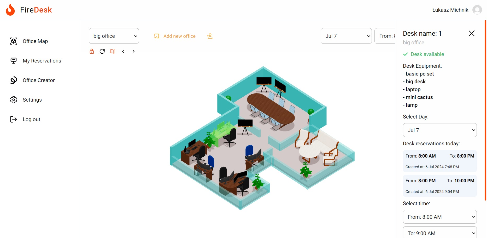
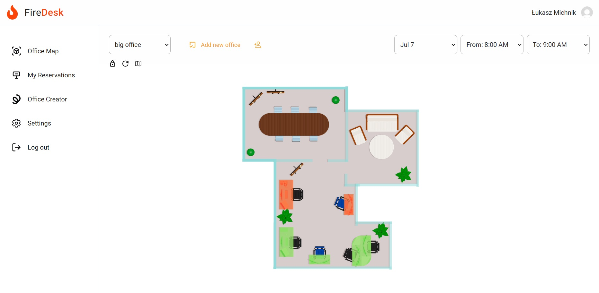
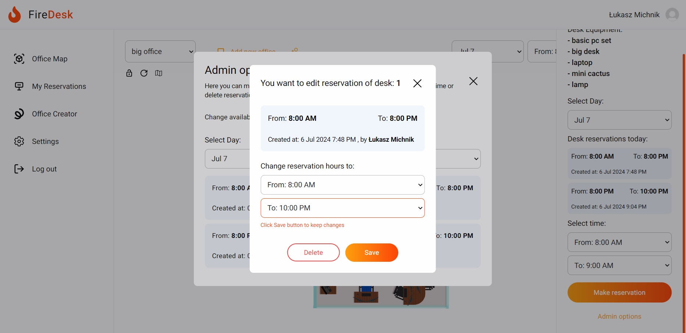
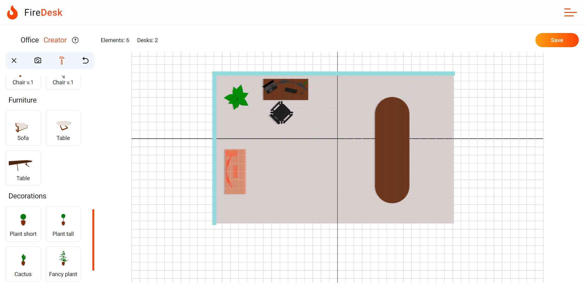
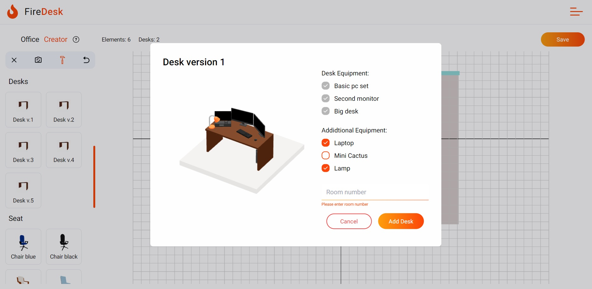
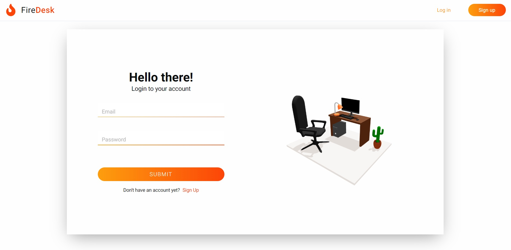

# FireDesk

## About the project

FireDesk is office management app made in coop with Xebia Company and Rzeszów University of Technology as a college subject in scrum methodology. The project consisted of creating a mvp that allows users to manage the office and book individual workstations, our team developed this idea with a 3d creator that allows each logged-in user to build their own model of the office. The application also includes admin options that allows to view and modify all the reservations of users added to the office through the invitation code. The application allows you to create, modify and delete reservations of individual workstations, creating own office 3d model and then adding users by invitation code.

See more details about this huge project <a href="https://portfolio-page-judijudi6.vercel.app/firedesk">HERE</a>

<a href="https://github.com/JudiJudi6/ICE-office-management-backend">See backend repo </a>

Live - no live :(

## Build with

## Pictures

## How to run

1. Clone the repo

   - Frontend:
     `git clone https://github.com/JudiJudi6/ICE-office-management-frontend.git`

   - Backend:
     `git clone https://github.com/JudiJudi6/ICE-office-management-backend.git`

2. Install NPM packages
   `npm i`

3. To run app
   `npm run dev`
